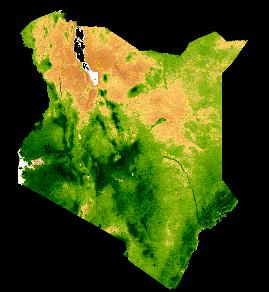

# Stuff here
stuff here too. 
Builds off this: https://github.com/google/earthengine-community/blob/master/tutorials/modis-ndvi-time-series-animation/index.md
and this https://developers.google.com/earth-engine/tutorials/community/modis-ndvi-time-series-animation#2_define_clipping_and_region_boundary_geometries

## Output
Looks like this:
> 
