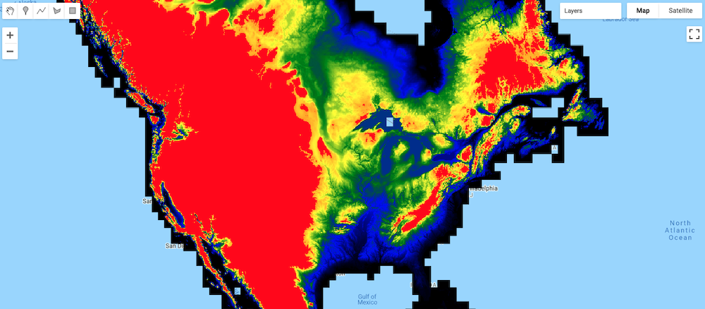

# Introduction to Google Earth Engine

Explain... see code here: https://code.earthengine.google.com/8675ccd49ee67b0048f13477c32930cd
See other labs here: https://developers.google.com/earth-engine/tutorials/edu#introductory-remote-sensing-code-labs

we start with basics of js

then we do the analysis

