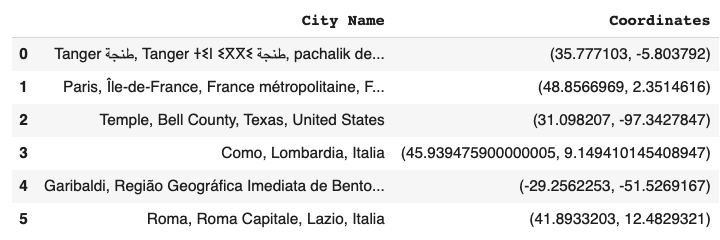
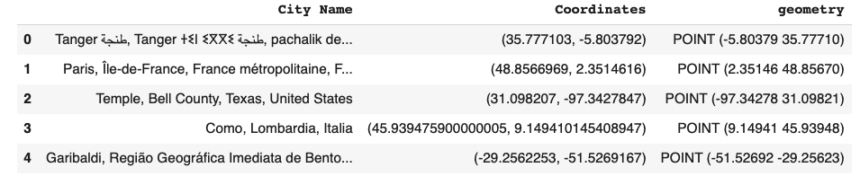
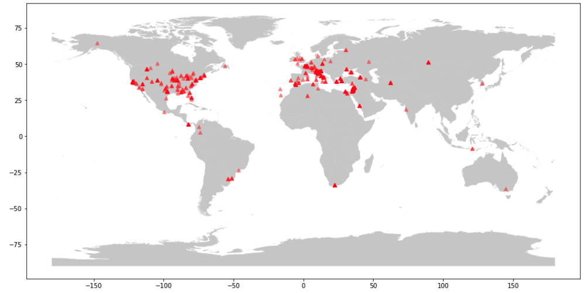
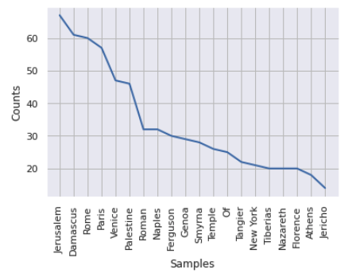
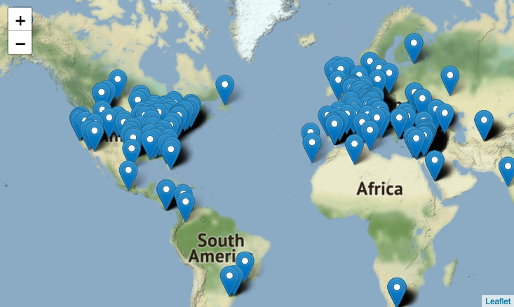

# Geoparsing with Python

This week we are going to work on _geoparsing_, which refers to the process of extracting place-names from text and matching those names with spatial coordinates. For GISers, it's easy to forget that massive amounts of geographic information are not contained with vector or raster data... not captured in `.shp` or `.gpx` files or neatly organized in `GeoJSON`... because these are the data models and file formats that we're used to working with. The reality is, however, that truly mind-bogglingly large amounts of geographic data currently reside in unstructured text. Think about it, you may attach a "location" to your social media feeds (likely where you are living or your hometown) but that doesn't reflect all the spatial references you make in social media posts. Human don't think in terms of latitude and longitude... we don't think in coordinates... and even placenames can be a problem since so many of them are vernacular. As an aside, I still don't understand how the word "square" in Massachusetts is used to refer to often - very particular - road junctions such as "Kelley Square" in Worcester, which is less of a place than it is a terrifying act of automotive faith.

I have used geoparsing a lot; mostly for analyzing social media data for what it can say about the geography of disasters or conflict. There is a lot of interesting data in, and approaches to, analyzing social media data for crisis events ([if you're interested in this kind of thing check out CrisisLex](https://crisislex.org/)). However, geoparsing can allow you to perform all kinds of other interesting analysis. For example, you can visualize the spatial footprint of a piece text, such as a novel or a piece of legislation.

Geoparsing is a specific kind of procedure known in geography as [toponym resolution](https://en.wikipedia.org/wiki/Toponym_resolution). However, there is a fairly big difference between the two terms. Toponym resolution focuses on deriving geographic information from structured, unambiguous references, such as the post office’s use geocoded state abbreviations for routing. Geoparsing, on the other hand, indicates that the input text contains unstructured ambiguity; for example, a text may reference Georgia, which can be either a country or a state in the southern USA, and it is the task of the geoparsing researcher to resolve that ambiguity. In the tutorial that follows, we're going to parse the text of a well known book and try to map its spatial footprint. The text is Mark Twain's _[The Innocents Abroad](https://en.wikipedia.org/wiki/The_Innocents_Abroad)_, which remains a hugely popular travelogue despite being first published in 1859!

We'll walk through how to gepoarse Twain's text; then as some critical questions about how accurate we think our analysis is; then finish up wth a coding challenge.

### To complete this assignment you will need:
- A coding edtior (I'm writing this tutorial for Google Colab),
- the "World Countries" files in the data folder of this repo (there are several files that, together, make the common `.shp` file!), and
- Github for submitting your code

### What you will submit:
A link to your Github repo with your response to the Coding Challenge at the end. The repo must contain your Python code (either as script in `.py` or a notebook in `.ipynb` format). The `README` of your repo should introduce your code and answers some questions about the code used in this tutorial.

## Installing & Loading the necessary packages
Remember that Colab comes with a variety of packages/libraries installed. You can always check to see if something is already loaded into your Colab environment using the following code:

```Python
# Check to see if geopandas is already loaded into your Colab environment: will return True or False
import sys
'geopandas' in sys.modules
```
Below is the code to install a range of packages (some of which may already be in Colab) along with the necessary commands to import various things from them.

```Python
# Install packages as needed
!pip install geopandas
!pip install geotext
!pip install numpy geotext
!pip install matplotlib
!pip install urllib #error
!pip install geopy
!pip install shapely
!pip install descartes
!pip install nltk

# Importing all the libraries we'll use
import geopandas as gpd
import pandas as pd
import nltk
import numpy as np
import matplotlib.pyplot as plt
import urllib.request#new
import descartes

from urllib import request
from geotext import GeoText
from geopy.geocoders import Nominatim
from geopy.exc import GeocoderTimedOut
from shapely.geometry import Point, Polygon
```
Now that we've got everything we need. Let's get down to coding!

## Scraping Our Text from the Web
The first thing to do get a copy of _The Innocents Abroad_. The full text is freely available online, under open license, through [Project Gutenberg](https://www.gutenberg.org/). We'll use the `requests` object from the `urllib` module, pass the url for the raw `.txt`, and decode it in utf-8, which is a common form HTML document encoding.

```Python
url = 'http://www.gutenberg.org/files/3176/3176-0.txt'
response = request.urlopen(url)
raw = response.read().decode('utf8')
print(f'{type(raw)}, \n{len(raw)}, \n{raw[:501]}')
```
In the code above I'm using the `print` statement to preview what I'm scraping and make sure I'm getting what I want. Do you see the arguments for the data "slice" in the code? This code will show you the first `501` index places, but you could easily change this.

## Geoparsing!
Now that I know I've scraped what I've expected to scrape, we'll use [GeoText](https://pypi.org/project/geotext/), which allows us to extract city names.

```Python
places = GeoText(raw)
cities = list(places.cities)
cities #Calling this shows my list of cities. You could also use print(cities)
```
You may notice a lot of duplicate city names here. In this case, I want to keep these so that because I'm basically going to plot them on a map using a color scheme that means cities with lots of duplicates are darker! There are other ways to do this, but this is the approach I'm using here.

Next, we need a gazetteer get the spatial coordinates for each city. We'll be using [OpenStreetMap's](https://wiki.openstreetmap.org/wiki/About_OpenStreetMap) search tool called [Nominatim](https://wiki.openstreetmap.org/wiki/Nominatim), which, given a city or state name, reverse geocodes that name and returns its coordinates. There are a few things going on in the code below to be aware of:
1. Nominatim requires a `user-agent` to be identified. This is basically just your e-mail address and OpenStreetMap (or "OSM") uses it to gather user statistics. I've used a dummy e-mail address below: you will need to use your own! So be sure to replace `YOURNAME@YOUREMAIL` with your own e-mail address.
2. Next to where I set the `user-agent` you'll see `timeout=2`, which I'm using to set the Nominatim API’s timeout to 2 seconds. Basically, I'm hoping that if an individual search takes longer than 2 seconds, it’s not really a city name, and the script will thus weed out non-names from the final map. This is, admittedly, a crude way of handling this, but it works well for a first pass!
3. You'll see that I start with an empty list called `lat_lon` and then use a `for` loop to go through all cities. Within this is `except GeocoderTimedOut as e:`, which is an error-handling statement that skips the current search if the API times out.
4. Finally, this step can take several minutes to complete! While writing this tutorial, this code block took anywhere from 2 - 8 minutes to run. So don't worry if it takes a little time.

```Python
geolocator = Nominatim(user_agent='YOURNAME@YOUREMAIL', timeout=2) # requires your e-mail address to track usage. Timeout set for 2 seconds.

lat_lon = []
for city in cities:
  try:
    location = geolocator.geocode(city)
    if location:
      # If you want to see only lat/lon as they process you can include the following code here but I found it added a lot of time to the operation: print(location.latitude, location.longitude)
      lat_lon.append(location)
  except GeocoderTimedOut as e:
    print("Error: geocode failed on input %s with message %s">
          (city, e))
lat_lon
```
Now that we've got coordinates, let's put the city names and coordinates into a Pandas dataframe. Note that, in the last line of code in this block, I'm passing `6` as a way to preview only the first 5 index places. This is another bit of incremental development just to make sure my dataframe is looking good.

```Python
df = pd.DataFrame(lat_lon, columns=['City Name', 'Coordinates'])
df.head(7)
```

You should see something that looks like this...


I'm not sure if you noticed this, but the coordinates are currently formatted as tuples! We'll use the Python package Shapely to transform them into point objects, so each city can be represented by a point our map. The code below iterates over the dataframe series that contains the coordinate tuples, turning them each into Points, and switching the order of latitude and longitude, because that’s the order the map object I downloaded uses. Again, I'm running the output and passing an index value, `[:6]` to preview the first five index places of the output. What I'm looking for is a list containing a bunch of `<shapely.geometry.point.Point at 0x7f0e3d79dc10>`.

```Python
geometry = [Point(x[1], x[0]) for x in df['Coordinates']]
geometry[:7]
```
Putting these point objects back into a dataframe allows us to plot them easily. Instead of a pandas dataframe, we'll use a geopandas dataframe, which can easily handle these types of objects. The code below adds a column to the dataframe called `geometry` that includes the flipped coordinates. We'll be using the `epsg:4326` coordinate system, which is basically WGS84. If you're a projection nerd, then you'll enjoy this [blog post about this by the fabulous Lyzi Diamond](https://lyzidiamond.com/posts/4326-vs-3857).

```Python
# coordinate system we're using
crs = {'init': 'epsg:4326'}

# convert df to geo df
geo_df = gpd.GeoDataFrame(df, crs=crs, geometry=geometry)
geo_df.head()
```
You should now see something that looks like this.



Alright, now we've geoparsed an entire novel, formatted it, and are ready to map. However, we actually need some kind of reference to map to: otherwise we'd just have a bunch of points against a blank canvas. This repo includes the "World Countries" `.shp` file. However, since we're hosting the file on Github (and not ArcGIS online) we actually see each of the five files that make up a `.shp` file. If you didn't know this already, a shapefile is basically the same as a zipped file. Anyways, you'll need to load all of these files into your Colab. So download them to a temporary location, and be sure to add the `.cpg`, `.dbf`, `.prj`, `.shp`, and `.shx` files when prompted after you run the following line of code:

```Python
# Upload local script to Colab - running this creates a "choose file" button to upload local files.
# .shp file downloaded from https://hub.arcgis.com/datasets/a21fdb46d23e4ef896f31475217cbb08_1
from google.colab import files
uploaded = files.upload()
```

## Plotting Our Data
Okay... NOW we're ready to plot our data! Remember when I mentioned that I was keeping duplicate locations? Well, the fact that I did not remove duplicate location entries means that, if I set the transparency of the markers, more frequently referenced locations will appear more opaque than those referenced just once. That’s being done with the `alpha` parameter in the `plot` object. Opaque markers should roughly correspond to cities mentioned often, whereas transparent ones were mentioned fewer times.

```Python
# world map .shp file we down/uploaded
countries_map = gpd.read_file('Countries_WGS84.shp')

f, ax = plt.subplots(figsize=(16, 16))
countries_map.plot(ax=ax, alpha=0.4, color='grey')
geo_df['geometry'].plot(ax=ax, markersize = 30, color = 'r', marker = '^', alpha=.4)
```

Your map should look something like this:


Now we've mapped the spatial footprint of one of the great works of American literature! This is truly pretty awesome: we scrapped text from the web, geoparsed it to get lat/lon from unstructured text, then did some data munging to create our nice dataframe, and now we have a sweet map. However... we could probably take things a step further...

## Plotting Word Frequency
I know it's hard to believe... but some people can't really interpret maps well. I find that no matter how much time I spend creating a really great map, I have to spent almost as much time helping people understand what it says. As my career has gone on, I've taken to presenting the same information in a variety of ways: a map, a chart, a short piece of narrative text. I'll combine multiple ways of understanding a piece of analysis to make sure people understand what I'm trying to say.

So, we've got a nice map... but can you tell me what the top 20 most mentioned places are from that map? Let's add a plot that shows frequency of city mentions to really give this analysis some depth. In the code below, we're using both Matplotlib (along with an associated dataviz library called [Seaborn](https://seaborn.pydata.org/)) and [NLTK](https://www.nltk.org/) to create a simple plot that will clearly show the top twenty most mentioned city names along with a count of how many times they are mentioned. I mean... we did all that work to get the data, why stop with just one output!

```Python
#Import datavis libraries
import matplotlib.pyplot as plt
import seaborn as sns # used to set the style of the figures

# Figures inline and set visualization style
%matplotlib inline
sns.set()

# Create freq dist and plot
freqdist1 = nltk.FreqDist(cities)
freqdist1.plot(20) #running this w/out an argument plots all words! Here, we're specifying the top 20
```
You should now have a graph that looks something like this:

Oh, yeah! Now we've got a map that shows the _overall_ spatial footprint of the text, as well as giving the viewer an idea of which places are mentioned more than others... but we've added a slightly deeper piece of analysis that specifically calls out the top twenty most mentioned places. Still... could we go even further? I mean... we _did_ just make some sweet maps with Folium in our previous lab...

## Creating a Folium Map of our Data
Okay, I'm admittedly taking this tutorial kind of far... but once you've already done all the work to get the data and get it into shape, why note have some fun with it? The code below uses Folium to produce a basic interactive map of our data.

```Python
#import required libraries, packages, etc.
import folium
from folium import plugins
import json
```
Now that we've got that set, let's create our map:
```Python
# Converting geopandas dataframe to geojson so it can be plotted on a web map with folium.
geo_df['geometry'].to_file("TwainCities.geojson", driver='GeoJSON')

# initialize the map at a global scale with a point midaway between U.S. and Europe as the center.
TwainMap = folium.Map(location=[32.826919, -41.225228], tiles='Stamen Terrain', zoom_start=2)

folium.GeoJson("TwainCities.geojson").add_to(TwainMap)

# Display your map   
TwainMap
```
You're map should look something like this (remember you can play with some of the parameters, including basemap, to customize it).


# Coding Challenge
Create a function that takes a URL as an argument, creates a map _and_ a word frequency distribution. Importing necessary files and libraries can be separate code blocks. You've got all the pieces you need above, all you have to do is put it together. Then you can just pass your function a URL (for a text document) and immediately analyze the spatial footprint of the text and get a summary of the most mentioned places.

Use a different `.txt` for your function. You can definitely choose any text in Project Gutenberg. You could also create a `.txt` file, place it in your Github repo, then pass the raw url to analyze your own text.

Your `README` should briefly introduce your code: tell how you developed it, if there were any major challenges (and how you debugged them). I'd also like you to reflect on the code presented in this tutorial. Here are a few questions:

- Is the gazetteer we're using appropriate for the text? What might be some of the challenges of using Nominatim with a book published in 1859?
- How accurate do you think the outputs are? Are there any city names that seem suspect? If so, what are some Natural Language Processing methods that you could use to filter words that might be city names, but probably weren't intended as city references in the text?
- What are some alternative approaches to mapping the data? The tutorial here uses duplicate entries and opacity to present a type of "color ramp": could this be done better?
