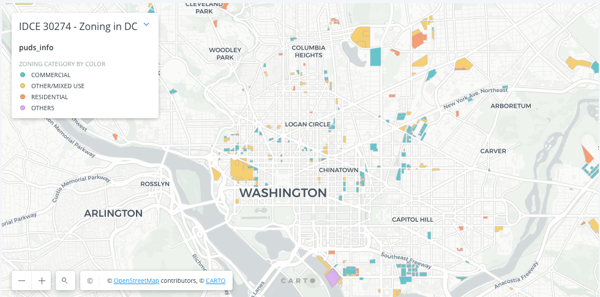

# Creating Zoning Maps Using Python & Pandas
By following this tutorial, you’ll learn to navigate geographic shapefiles in a Jupyter Notebook (we'll be using Colab). You will upload data from DC’s open data portal, and then concatenate datasets and conduct some basic analysis. Finally, you'll create a basic map, and create a new `.shp` file that can be used with ESRI products... or can be uploaded to [Carto](https://www.carto.com/)! 

Check out a live version of [my finished product here](https://shadrock.carto.com/builder/df4c5d9f-1c1e-4df4-bb15-42681ba14aac/embed?state=%7B%22map%22%3A%7B%22ne%22%3A%5B38.838460360929645%2C-77.21660658717157%5D%2C%22sw%22%3A%5B39.03127554305828%2C-76.8502812087536%5D%2C%22center%22%3A%5B38.93493348047009%2C-77.03344389796258%5D%2C%22zoom%22%3A12%7D%7D). 

### To complete this assignment you will need:
- A Google account. We'll be using Colab, but also space in your Google Drive: this will be nice example of hosting a small data science project with your own services.
- Data downloaded from [OpenData D.C.](https://opendata.dc.gov/). If, for some reason you can't access the site or download the data, there is a [data folder in this repo](data) that contains archived data you could use. That being said, I want you to use the most recent data you can get!
- A free student account on Carto. You get _only_ get one of these by authenticating with your [Github Student Developer pack](https://education.github.com/pack) (pretty nifty, eh?). [Go here for details and links](https://carto.com/help/getting-started/student-accounts/): the process shouldn't take long. Note that a normal, free, Github account will not work!

### What you will submit:
A link to your Github repo. The repo must contain your Python code (either as script in `.py` or a notebook in `.ipynb` format). The `README` of your repo should briefly summarize the project (in your own words), show an image of your final output, *and* link to your final map in Carto. You do not need to include the input/output files (as I have here) but it might be a good idea if you want to use this repo as part of your portfolio. 

## Why is this lab important? 
The United States is facing a housing crisis: the cost of housing has skyrocketed and wages have not kept pace: housing instability threatens 11 million Americans. One, little understood, aspect of the housing crisis is evictions. The [Eviction Lab](https://evictionlab.org/) is studying this to try and understand the phenomenon, which is potentially even [more devestating during the current pandemic](https://www.forbes.com/sites/samchandan/2020/07/25/americas-next-housing-crisis-how-the-pandemic-is-pushing-renters-to-the-brink/#2a98d7bd1527), and which is is [starkly impacted by race and income](https://www.urban.org/urban-wire/new-data-suggest-covid-19-widening-housing-disparities-race-and-income). The Eviction Lab built the *first* nationwide database of evictions only *recently*. This is amazing when you consider it: there was no data available! Remember this in any humanitarian program you are part of: if it isn't measured, it isn't managed. How can you manage something you don't know exists!

One way to study eviction is to look at how cities handle [zoning](https://www.smgov.net/Departments/PCD/Zoning/What-is-Zoning/), the laws which govern how land can be used. Gentrification, the process of renovating and improving an area to attract wealthier residents, can cause displacement or current residents, but can potentially also unlock economic opportunity. The city of Washington D.C., is using "Planned Unit Developments", in an attempt to broadly redistribute the benefits of urban redevelopment by offering amenities such as affordable housing, improved public transportation, and in exchange for zoning exemptions. However, this will need to be studied over the long term to see if it works. For example, Planned Unit Developments, even those offering affordable housing as part of their community benefit package, could still contribute to higher eviction rates in anticipation of the appreciation of land values. 

In this lab, we'll use Python to gather some open data about zoning in D.C. and create a map of zoning exemptions. This would be the first step to overlaying these data with other demographic data and will visually answer the question:
_How can we categorize buildings that received a zoning exemption in Washington, DC?_

## Data from Open Data DC!
The data for this exercise comes from DC’s open data portal, specifically [their page on Planned Unit Developments](https://opendata.dc.gov/datasets/planned-unit-development-puds). Isn't it great that they are supplying open data? From the PUDs page, download the shapefile from the dropdown options. You'll need to unzip the folder and add all the different files that make up a `.shp` file to your Drive. 

Now navigate to the portal's [Affordable Housing page](https://opendata.dc.gov/datasets/affordable-housing), and download the _spreadsheet_ (not the shapefile!). For the purposes of this exercise, we'll walk through the process of taking a common data file like a `.csv` and giving it special geospatial properties.

Once you have downloaded the data, you will need to upload it to your Google Drive. To facilitate easy access to data during the code-along, set up the following file structure:
- From your My Drive folder create a folder called `gis`
- Within that folder, create `input` and `output` folders
- Within the input folder, upload the `Affordable_Housing.csv` as well as all the files from inside the Planned Unit Development folder, after unzipping it

It’s important that you **use these exact naming conventions and organization system or that you make the required updates to the import/export statements during the code-along.**
You will also need a crosswalk made for this activity. You can get that file in this repo (called `zoning_crosswalk.csv`) — then upload it to your `input` folder in Drive as well. A [crosswalk](https://en.wikipedia.org/wiki/Schema_crosswalk) is a table that shows equivalent elements (or "attributes") in more than one database schema. It maps the elements in one schema to the equivalent elements in another.

## Translating Maps to Tables
We’ll import each layer in our dataset with an initialization of its coordinate reference system (CRS). This set of numbers (e.g. `epsg:4326`) comprises a standard coordinate frame for the Earth — explaining how points in space relate to each other. We will be looking at the physical location of buildings, expressed in longitude and latitude, as well as their location within the political borders of Washington, DC based on [EPSG’s standard 4326 CRS](https://spatialreference.org/ref/epsg/wgs-84/).

We're going to use a popular [Python package called Pandas](https://pandas.pydata.org/). Some people have referred to Pandas as "basically Excel for Python". You can structure your data as rows and columns and perform operations with similar functionality to those of Excel.

[GeoPandas](https://geopandas.org/) is a library that builds upon these capabilities and enables modeling of points, lines, and polygons from the GIS package [Shapely](https://pypi.org/project/Shapely/). You will also need to import a couple additional packages called rtree and spatialindex to support operations in GeoPandas. The relationship between all these different packages, libraries, etc. is called "dependencies" and often times just debugging your dependencies can require some time and effort. Luckily, we've already done that for you!

Although pandas is already installed in the Google Colab environment, we will need to install the more specific GIS packages. In order to bring these geospatial-specific packages into Google’s environment, install them by running the following code (note that this may take a few moments and that you'll likely see lots of update messages).

Also note that we're using `import ... as` to simplify the name. So `pandas` will be referred to as `pd` in our code... this is just a way to simplify and shorten things. On to the code:
```python
# Add gis packages to colab environment
!pip install geopandas
!apt-get install -y libspatialindex-dev
!pip install rtree

# Then import packages
import pandas as pd  # provides interface for interacting with tabular data
import geopandas as gpd  # combines the capabilities of pandas and shapely for geospatial operations
from shapely.geometry import Point, Polygon, MultiPolygon  # for manipulating text data into geospatial shapes
from shapely import wkt  # stands for "well known text," allows for interchange across GIS programs
import rtree  # supports geospatial join
```

The final item you should see in the list above is `Successfully installed rtree-0.9.4` (or some later version). 

Now, we’ll connect Google Colab to Google Drive. This is an easy way to manage small data science projects and store relevant data in your Drive. When you run the code below, Google will ask you for an authorization code that you will copy from the provided link and paste into a text box in Colab. Afterwards, your Colab notebook will be linked to your Google Drive.
```python
from google.colab import drive
drive.mount('/content/gdrive') # connects Colab to your Google Drive
root_path = 'gdrive/My Drive/gis/' # set root path to folder where you uploaded the data
```
Now we can import our data files. Only the PUDs shapefile has geographic properties that can be interpreted by GeoPandas. Mirroring pandas’s `.read_csv()` method, GeoPandas’ `.read_file()` function requires the filepath to the `.shp` file. Then we need to initialize geographic properties using the standard crs that we discussed previously.

In the code below, the PUDs shapefile component is being read in as a [GeoDataFrame](https://geopandas.org/reference/geopandas.GeoDataFrame.html) while the two csv files are read in as standard pandas DataFrames. **Be aware that there may be character differences between your filenames and what is encoded below! Double check (or copy/paste) your file names if you get an error.**
```python
# Read in PUDs file as a geodataframe and initialize coordinate reference system (CRS)
puds = gpd.read_file(root_path+'input/Planned_Unit_Development__PUDs.shp', crs = {'init' :'epsg:4326'})
aff = pd.read_csv(root_path+'input/Affordable_Housing.csv')
crosswalk = pd.read_csv(root_path+'input/zoning_crosswalk.csv')
```
In terms of quickly examining the datasets, trying running `info()` and `.sample()` methods on each DataFrame. 
```python
# Running this code grabs rows from the first 3 index places (4 rows total!)
puds.sample(3)
```
```python
# This gives you a summary of what is within the Affordable housing .csv
aff.info()
```
```python
# This gives you a summary of what is within the PUD .shp file
puds.info()
```
In the above code, notice that the last column is `geometry`. This contains the vectors of the polygons representing the exterior of the zoning exempted buildings.

Next, let’s turn the Affordable Housing csv into a GeoDataFrame. We’ll do this by wrapping the longitude (‘X’) and latitude (‘Y’) in a Shapely POINT object, as follows:
```python
# Create a geometry column in the affordable housing dataframe
aff['geometry'] = aff.apply(lambda row: Point(row.X, row.Y), axis=1)
aff = gpd.GeoDataFrame(aff, crs={'init' :'epsg:4326'})
```
Now when we `.sample()` the dataframe, you’ll see a `geometry` column (scroll to the far right ot see it) containing a POINT object for each record. `.info()` confirms the data type has transformed into a GeoDataFrame.
```python
aff.sample(1) #sampling to the first index... or row headers and one row.
```
Now merge the datasets based on their geographic intersection:
```python
# Use geospatial join to identify which PUDs include affordable housing projects
puds_aff = gpd.sjoin(puds, aff, op='intersects', how='left')
```
then
```python
# Check our Merge - incremental development, we're checking as we go!
puds_aff.info()
```
Now we have one master GeoDataFrame containing the information about zoning exemptions as well as affordable housing projects at the same geographic locations. Because we left-joined with the puds dataframe as the left table, the resulting geo-dataframe maintains the puds’ `geometry` column and drops the aff dataframe `geometry` column from the table.

As a final step — we'll turn zoning codes into plain english, by merging with the zoning categories crosswalk. This will categorize zoning exempted buildings as Commercial, Residential, or Other/Mixed Use.
```python
# Merge dataframe with zoning categories crosswalk
puds_info = puds_aff.merge(crosswalk[['Zone_Cat']], how='left', left_on='PUD_ZONING', right_on=crosswalk['Zone'])
```
```python
# Quick count using print statements to show us how many PUDs there are total, and how many offer affordable housing.

print(f"Total count of PUDs: {puds_info.shape[0]}")
print(f"Count PUDs offering Affordable Housing: {puds_info.loc[~puds_info.PROJECT_NAME.isna()].shape[0]}")
```
Now let’s see how those PUDs fall into each zoning category. Creating a map on a GeoDataFrame can be done with a single line of code using the `.plot()` function. The resulting map will show zoning exemptions within Washington, DC colored by type.

```python
# Create a map of PUDs by Zoning Category
puds_info.plot(column='Zone_Cat', legend=True, figsize=(16,8));
```
Let’s take a look at one more — this time the location of zoning exempted buildings that provide affordable housing units.

```python
# Create a map of just the PUDs that provide Affordable Housing
puds_info[puds_info['TOTAL_AFFORDABLE_UNITS']>0].plot(column='TOTAL_AFFORDABLE_UNITS', color='grey', figsize=(16,8));
```

Woot: we now have a map! But let's not stop there... this is, admittedly, not the best map in the world. So let's output our new data into a `.shp` file using the following code: 

```python
# Export geodataframe as shapefile within Colab environment
puds_info.to_file('puds_info.shp')

# Copy shapefile components from Colab environment to Google Drive using bash script
!cp puds_info.cpg 'gdrive/My Drive/gis/output'
!cp puds_info.dbf 'gdrive/My Drive/gis/output'
!cp puds_info.prj 'gdrive/My Drive/gis/output'
!cp puds_info.shp 'gdrive/My Drive/gis/output'
!cp puds_info.shx 'gdrive/My Drive/gis/output'
```
Check your folder in drive to see that you have all the components of a shapefile!

# Creating a Finished Product with Carto
- Uploading your data to Carto will require formatting your `.shp` file _as a `.zip` file_. Fortunately, you can do this very easily by downloading your entire `outputs` folder from your Google Drive, which will automatically create a `.zip` file. [see more info importing files on the Carto site here](https://carto.com/developers/import-api/guides/importing-geospatial-data/#supported-geospatial-data-formats)). 
- Sign in to Cartoi in with your Github account (remember, you *must* have signed up for Githubs student developer pack to use Carto: using a regular free Github account will not work). 
- Once you sign in you will be taken to your Carto dashboard (the URL will look something like `https://yourusername.carto.com/dashboard` for the button to create a new map. The process is pretty intuitive, but if you've never used Carto, [start here with a walk through about how to upload new data](https://carto.com/help/tutorials/getting-started-with-carto-builder/).
- When you create a new map, you’ll be taken to the map “Builder” to edit your map! Have fun playing around with different basemaps, stylings for your polygons, etc. There's a lot of good documentation and tutorials about using map builder online ([start with Carto's documentation here](https://carto.com/help/tutorials/using-builder/)), but it's fairly straight forward to learn and you don't need to code anything: you can do it all via browser using the dashboard. 
- To symbolize your polygons by category, change the polygon style to show `zone_cat`. 
- Make sure you add/update a legend that helps viewers understand what the colors of your polygons mean. 
- Publish, Update, and share your maps! ([More details on this at Carto](https://carto.com/help/tutorials/publishing-and-sharing-maps/)). And don't forget to link your final `README` to your online map!

# Citation
This tutorial was originally created by [Nicole Janeway Bills](https://twitter.com/nicole_janeway), who provides a nice [video walkthrough on YouTube here](https://www.youtube.com/watch?v=b9G2T4CPYVM&feature=emb_logo). I've changed some of the code slightly to deal with different inputs (Open Data D.C.'s file formatting has changed since the original tutorial); added more background context on the scenario, and added the use of Carto for a final output. 


