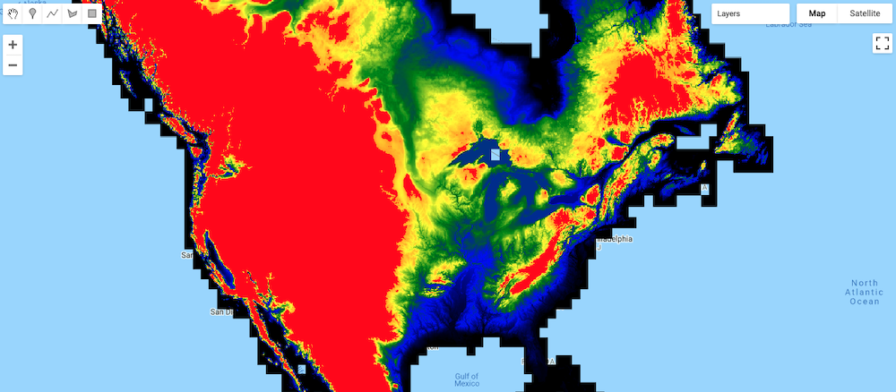

# Introduction to Google Earth Engine (GEE)
This repo briefly lays out a "code along" exercise that I do with students to introduce them to [Google Earth Engine](https://earthengine.google.com/). This activity introduces students to the basics of JavaScript and builds on what they already know about Python. This code along starts with `JS_basics.js` to practice some basic coding and is followed by `DSM_analysis` which is the student's first actual analysis in GEE.

## The Code Along
The lesson is fairly straight forward. I lecture, record an asynchronous lecture, or link to videos that introduce students to what GEE is and the basics of the development environment: essentially what they see in the browser ([more info here](https://www.google.com/earth/outreach/learn/introduction-to-google-earth-engine/)). These are released before our code along to give students a good background in what they will be working with. I also have them sign up for the GEE service well in advance, since the approval process was taking around 1 week at the time of writing.

I start by opening a new file and simply doing some basic JavaScript programming to go over things like variables, lists, dictionaries, `print` statement, and functions: all the same things they already know about in Python. The code for this is found in the `JS_basics.js` file in this repo. Note that no geospatial analysis takes place during this portion of the code along. Instead, all outputs are rendered in the GEE console tab.
> 

Once the basics are out of the way, I move on to some basic analysis and visualization. The code for this can be found in the `DSM_analysis.js` file in this repo. Students are asked to start a new file (or over-write the file containing the basics of JS) and import the ALOS World 3D - 30m (AW3D30) global digital surface model, which has a horizontal resolution of approximately 30 meters. There are actually a few versions of this available in GEE, but the code I have used references bands specific to version 2.2, released in April 2019, which [can be found here](https://developers.google.com/earth-engine/datasets/catalog/JAXA_ALOS_AW3D30_V2_2). The code takes students through the steps of:
- importing the data;
- exploring the data in the console window to ensure they have the right data set;
- visualizing the data using a ([cartographically incorrect!](https://www.e-education.psu.edu/maps/l5_p5.html)) qualitative color scheme (it's the easiest to code!); and
- creating a mask that only shows areas of elevation over 500 meters (seen below in red).

> 

While my code is presented here as files, you can also access a [snapshot of my code on the GEE site here](https://code.earthengine.google.com/8675ccd49ee67b0048f13477c32930cd).
