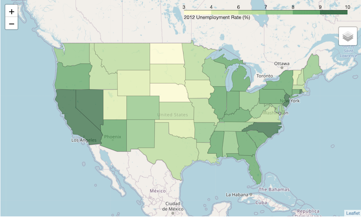

# Interactive Maps with Folium!
This tutorial uses a Python library called [Folium](https://python-visualization.github.io/folium/), which builds on a common web mapping javascript library called [Leaflet](https://leafletjs.com/). Basically, Folium brings the power of Leaflet JavaScript into Python, which means you can build really nice, interactive maps right into your Python notebook!

We'll write code to quickly and easily create interactive maps of Starbucks locations in Los Angeles County. Those of you who live in MA and have sworn an oath to Dunkin will appreciate this, no doubt. By the end, you'll be able to create:
- A choropleth map which shades in LA County zip codes based on how many Starbucks are contained in each one (and you'll learn why this is a _terrible_ idea!)
- A precise map of all Starbucks' locations in LA County

### To complete this assignment you will need:
- A Google account and a Colab notebook.
- Data downloaded from this repo to upload to Colab (or copy to your Google Drive and mount that to Colab).
- If you're *not* using Colab, you'll need a Python coding environment with [Pandas](https://pandas.pydata.org/), [Folium](https://python-visualization.github.io/folium/), and [JSON](https://docs.python.org/3/library/json.html) libraries.

### What you will submit:
A link to your Github repo. The repo must contain your Python code (either as script in `.py` or a notebook in `.ipynb` format). Your `README` should contain a brief description of the lab along with a 150-200 word discussion about what you learned.

### Why this lab is important
In this lab, we'll be using a Pandas dataframe to combine different parts of datasets to create an interactive map. In Pandas, you can think of the dataframe as a version of a spreadsheet: it is the most commonly used Pandas data structure. You can [learn more about Pandas data structures here](https://pandas.pydata.org/pandas-docs/stable/user_guide/dsintro.html). You'll also learn about Folium. I mean... interactive maps, who can resist?!?! Finally, we're going to critically look at some of the choices we're making with our inputs and how the data we're using actually create a lousy map.

# Choropleth Map Using Zip Codes (generally a terrible idea)
This tutorial uses a `.csv` and two `.geojson` files that can be found in the [data folder](/data). We'll start by loading our files in Colab (see here for [a variety of other ways you can bring your data into Colab](https://colab.research.google.com/notebooks/io.ipynb))

```Python
# Upload local script to Colab - running this creates a "choose file" button to upload local files.
from google.colab import files
uploaded = files.upload()
```

Next, we'll import all the needed libraries, create a dataframe (variable `df`) into which we'll put our `.csv` data and load up some spatial data in the `laMap` file.

```Python
import folium
import pandas as pd
import json
from folium import plugins

df = pd.read_csv('starbucksInLACounty.csv')

with open('laMap.geojson') as f:
    laArea = json.load(f)
```
The code below pulls together the needed pieces from our data to create one: we need to get a count for the number of stores in each zip code, then attach this to the appropriate geometry for that zip code using a Pandas "dataframe."

```Python
# group the starbucks dataframe by zip code and count the number of stores in each zip code
numStoresSeries = df.groupby('zip').count().id

# initialize an empty dataframe to store this new data
numStoresByZip = pd.DataFrame()

# populate the new dataframe with a 'zipcode' column and a 'numStores' column
numStoresByZip['zipcode'] = [str(i) for i in numStoresSeries.index]
numStoresByZip['numStores'] = numStoresSeries.values

```

Now that we have our data... let's create a map! A lot of the code you see below is explained in [the Quickstart Guide for Folium](https://python-visualization.github.io/folium/quickstart.html).

```Python
# Initiatlize a new map.
laMap = folium.Map(location=[34.0522,-118.2437], tiles='cartodbpositron', zoom_start=9, attr ='<a href="https://www.openstreetmap.org/">OpenStreetMap</a> contributors, <a href="https://public.carto.com/viz/397fd294-a82b-4470-90cc-6153ebad5bf6/embed_map">Positron by Carto</a> | Data from <a href = "https://github.com/ritvikmath/StarbucksStoreScraping">Ritvik Kharkar</a>')

# Create the choropleth map. Key components have explanatory comments.
folium.Choropleth(
    geo_data = 'laZips.geojson',         # the geojson which you want to draw on the map [in our case it is the zipcodes in LA County]
    name='choropleth',
    data= numStoresByZip,                # the pandas dataframe which contains the zipcode information and the values of the variable you want to plot on the choropleth
    columns=['zipcode', 'numStores'],    # the columns from the dataframe that you want to use
    nan_fill_color='grey',               # fill color for null values
    nan_fill_opacity=0.4,                # opacity for null values
    key_on='feature.properties.zipcode', # the common key between one of your columns and an attribute in the geojson. This is how python knows which dataframe row matches up to which zipcode in the geojson
    fill_color='YlOrRd',                 # Try some other colors: 'YlGn', 'OrRd', 'BuGn' 'BuPu', 'GnBu', 'PuBu', 'PuBuGn', 'PuRd', 'RdPu', 'YlGn', 'YlGnBu', 'YlOrBr', 'YlOrRd'.
    fill_opacity = 0.7,                  # fill color for data values
    line_opacity = 0.2,                  # opacity for data values
    legend_name = 'Number of Starbucks'
).add_to(laMap)

folium.LayerControl().add_to(laMap)

# Display your map
laMap
```
Your map should look something like this:


It can be difficult to understand how to get all the components in place for a choropleth, so let’s take a look at how it works. The choropleth needs to know what color to fill in for zip code 90001, for example. It checks the pandas dataframe referenced by the `data field`, searches the `key_on` column for the zip code and finds the other column listed in columns which is `numStores`. It then knows that it needs to fill in the color corresponding to 3 stores in zip code 90001. It then looks in the GeoJSON referenced by the `geo_data` field, and finds zip code 90001 and its associated shape info, which tells it which shape to draw for that zip code on the map. Through these links, it has all the necessary information.

Another way to think about this is with a visual:


### Other things to explore in Folium
When you first establish your map, there are a variety of parameters to set, including the attribution, which accepts basic `HTML` tags. I've purposefully referenced OpenStreetMap, Carto, and Ritvik Kharkar because they all created some part of the map (base layers, data, etc.), even though we've coded it. However, you can change the attribution to acknowledge whatever basemap style or data you are using.

The legend on the upper right is automatically generated for your values using 6 same sized bins. However, passing your own bins (number or list) is simple and can be found in the [Folium Quickstart Guide](https://python-visualization.github.io/folium/quickstart.html).  

### So why is this a terrible idea?
Let's take a close look at your map. Have a look at the northern part of LA county: there appear to be a small number of Starbucky's spread out over a rather large area... and those areas are just north of zip codes that are greyed out because they contain no data (hence, no Starbucky's).

Let's change another variable in your map. Let's change the `tiles = ` parameter in `laMap` from `'cartodbpositron'` to `'Stamen Terrain'`. Now what do you see? You should note that the null value areas make sense because they are basically covering mountains! You should also see that the zip codes covering the towns of Quartz Hill and Palmdale in the north of the county don't really fit around what look like city limits.

In using zip codes, we basically choose a random geography (shape) into which we binned the point data we have for Starbucky's. And in doing so we created a rather random map because zip codes aren't connected to any real human phenomena other than mail delivery. When we use other administrative units, such as state, counties, census tracts or blocks, we're using geographies that relate to people and have been specifically designed to make some statistical sense or to relate to something in the 'real world'. This, of course, is why [gerrymandering](https://en.wikipedia.org/wiki/Gerrymandering) is such a big deal in our country: political parties create voting districts using completely made up geographies that don't really represent the underlying population.

In GIS, the geography you choose to aggregate your data into, can radically alter the representation of your data. We call this the "[Modifiable Areal Unit Problem](https://www.e-education.psu.edu/sgam/node/214)" or MAUP. Have a look at the image below: exact same point data, represented as a chorolpeth using 3 different zones.


Unfortunately, I see really good coders (and even some GISers) who don't understand the concepts of geography who still aggregate data into zip codes and it drives geographers crazy. [Carto has a nice blog post about this](https://carto.com/blog/zip-codes-spatial-analysis/). Whenever you aggregate data into "zonal units" (e.g. shapes, geographies, whatever you want to call it) think carefully about _why_ you are using those particular shapes.

So, what should we do with our map? Well, the Python concepts of creating data frames that link several bits of data together are still valid... but let's create another map... maybe one that's a bit more accurate.

# Keep it Simple
The question that started this tutorial, "How many Starshucks are in each zip code", is conceptually flawed: zip codes are good for mail routes, but not much else. In practice stick to using things like census blocks, tracts, etc... or, why not just stick to addresses and exact locations? If we want to look at distribution of Starflunks in LA... well, then let's just make a map that shows the distribution of Starflunks in LA! Handily enough, creating a basic point map of all Starbucks in LA County from the latitude/longitude pairs in our dataframe is pretty straightforward.

```python
# initialize the map around LA County
laMap = folium.Map(location=[34.0522,-118.2437], tiles='Stamen Toner', zoom_start=9)

# add the shape of LA County to the map
folium.GeoJson(laArea).add_to(laMap)

# for each row in the Starbucks dataset, plot the corresponding latitude and longitude on the map
for i,row in df.iterrows():
    folium.CircleMarker((row.latitude,row.longitude), radius=3, weight=2, color='red', fill_color='red', fill_opacity=.5).add_to(laMap)

# Display your map   
laMap
```
Your map should look something like this:

We can clearly see all the Starbucks in LA County as red points within the LA County region (in blue). We've also used a base map that highlights the road network (because our areas of interest are all located on roads) and that highlights national forest areas (zoom in and you'll see it). Of course, you can customize any of the colors and shapes of the points by passing some different parameters into `folium.CircleMarker`. Compare this to the map above... which one gives a more "real" understanding of the distribution of StarJunks?

# Bonus Choropleth!
Given that we've created a "bad" choropleth using inappropriate geographies, let's quickly bang out a choropleth that uses appropriate geographies. We'll map unemployment by state using 2012 census data.

In this case, states are a great geography to use because each state has a host of laws related to being employed within that particular "zone." So looking at unemployment by state boundaries means that our map would actually show us something meaningful.

The code below is taken from the Folium documentation and uses a nifty trick to access data stored in a Github repo by that repo's URL. If you want to access the data files, see [the data folder in the Folium Github repo here](https://github.com/python-visualization/folium/tree/master/examples/data).

Another valuable thing to note is that the data we're using here map the unemployment rate _as a percent of population_. Whenever possible, [map rates instead of counts](https://www.e-education.psu.edu/natureofgeoinfo/c3_p17.html). Think of it this way. If 10 people in State A and State B are unemployed, and you map straight counts: both states would appear to be the same. But if State A has 100 people (10% unemployment) and State B has 1,000 people (1%), then you actually have very different levels of unemployment!

```python
url = 'https://raw.githubusercontent.com/python-visualization/folium/master/examples/data' #see files at https://github.com/python-visualization/folium/tree/master/examples/data
state_geo = f'{url}/us-states.json'
state_unemployment = f'{url}/US_Unemployment_Oct2012.csv'
state_data = pd.read_csv(state_unemployment)

statemap = folium.Map(location=[48, -102], zoom_start=3)

folium.Choropleth(
    geo_data=state_geo,
    name='choropleth',
    data=state_data,
    columns=['State', 'Unemployment'],
    key_on='feature.id',
    fill_color='YlGn',
    fill_opacity=0.7,
    line_opacity=0.2,
    legend_name='2012 Unemployment Rate (%)'
).add_to(statemap)

folium.LayerControl().add_to(statemap)

#render your map
statemap
```
Your map should look something like this:

Experiment with some of Foliums features: change basemaps, attribution, symbology etc. Happy coding!

# Citation
This tutorial is based on [this Medium Tutorial by Ritvik Kharkar](https://towardsdatascience.com/making-3-easy-maps-with-python-fb7dfb1036) and the associated [Github repo for his tutorial](https://github.com/ritvikmath/StarbucksStoreScraping). I've updated deprecated Folium code; re-orderd some of the steps to explain how his use of zip codes as a geography, while well intentioned and executed, is a huge conceptual problem; and added a brief follow-up showing a solid use of administrative units for choropleth maps.
